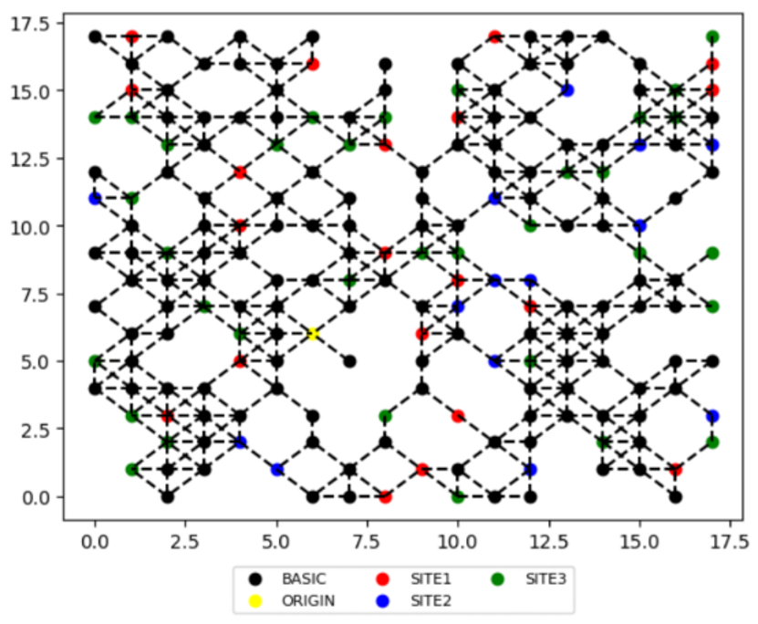

# Onward Lyra Graph Tool repository

## 🗒️ Description
This tool was built for use in solving the [traveling salesman](https://en.wikipedia.org/wiki/Travelling_salesman_problem) problem. This tool is named the`lyra_graphtool` and is intended to be used for optimizing paths on graphs between nodes given certain constraints. 

## ℹ About the tool

This tool was built for use in the [Off the beaten path challenge](https://thinkonward.com/app/c/challenges/off-the-beaten-path-sandbox). 
The challenge gives a high level overview of what this tool is best used for. Once you are ready to dive in to the tool the best place to start in this repository is the `00_lyra_graphtool_tutorial.ipynb` Jupyter notebook in the `/docs/examples` directory. The random walk example solution is located in `/docs/ready_setups`. Additional [API Documentation for using the tool](https://thinkonward.github.io/lyra_graphtool/)is also available.

 
## ⌨️ Initial Setup

To get started with the Lyra Graph Tool follow the instructions in `/docs/install.rst`. Package dependencies are listed in `docs/docs.rst`. 
